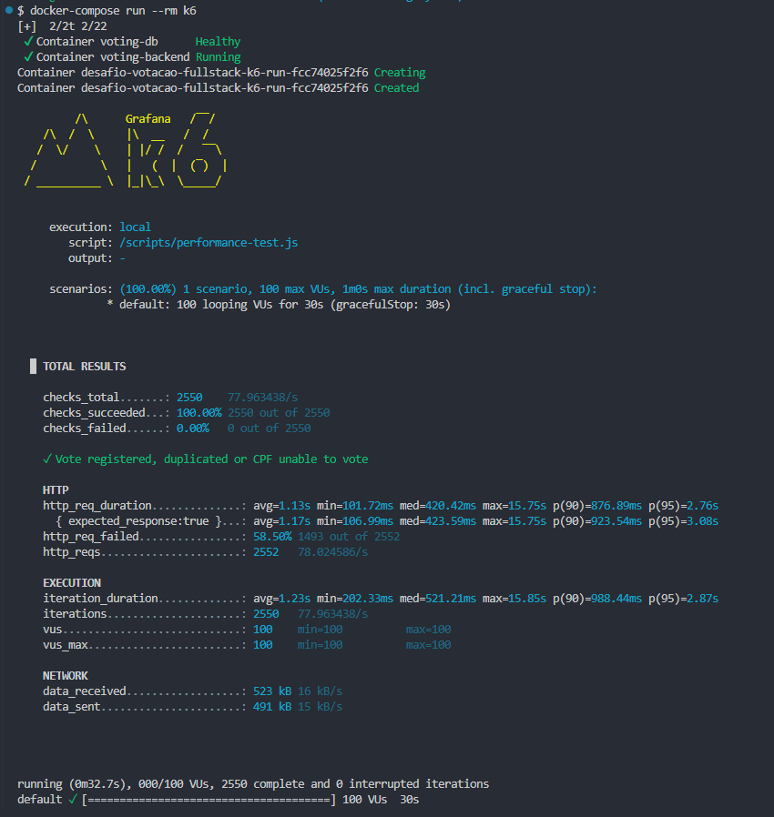

# Desafio Técnico: Sistema de Votação (Cooperativismo)

Solução fullstack para gerenciamento de sessões de votação em assembleias, projetada para alta concorrência e resiliência.

## Stack Tecnológica

* **Backend:** Java 26, Spring Boot 4.0.6
* **Frontend:** React 19, TypeScript 6.0, Vite 6, TanStack Query, Material UI 9
* **Banco de Dados:** PostgreSQL 16 (H2 para testes de integração)
* **Infraestrutura:** Docker, Docker Compose
* **Testes de Carga:** k6

## Arquitetura e Decisões Técnicas

A aplicação foi estruturada utilizando uma arquitetura em camadas (Layered Architecture), isolando responsabilidades entre rotas, regras de negócio e acesso a dados.

* **Tratamento de Exceções:** Centralizado via `@RestControllerAdvice`. Padroniza os retornos de erro da API (ex: `422 Unprocessable Entity` para regras de negócio violadas e `404 Not Found` para recursos inexistentes ou CPFs impossibilitados de votar), facilitando a interceptação de erros no frontend pelo Axios.
* **Frontend Data Fetching:** Adoção do TanStack Query para gerenciamento do estado assíncrono. Justifica-se pela necessidade de cache eficiente, retry automático e invalidação de queries ao interagir com a API de votação.
* **Logs e Rastreabilidade:** Uso de SLF4J para auditoria das operações np backend.

## Resolução das Tarefas Bônus

### Bônus 1: Integração com Sistemas Externos (Validação de CPF)
Implementado o `CpfValidationClient` atuando como uma Facade para simular a chamada externa. 
* A lógica injeta aleatoriedade nas respostas.
* Em conformidade estrita com o edital: CPFs inválidos ou não autorizados lançam uma exceção específica capturada pelo handler, retornando `HTTP 404` ou com o payload `{"status": "UNABLE_TO_VOTE"}`. CPFs autorizados prosseguem com o fluxo normal.

### Bônus 2: Performance (Cenário de Alta Carga)
Para suportar centenas de milhares de votos sem degradação do banco de dados:
* **Indexação:** Criação de índice único composto em `(voting_session_id, associate_cpf)` na tabela de votos. Garante validação de duplicidade em tempo logarítmico (O(log n)) e previne *race conditions*.
* **Connection Pooling:** Ajuste do HikariCP para suportar picos de concorrência.
* **Validação:** Implementação de testes de carga com **k6** (100 VUs) encapsulados via Docker.

### Bônus 3: Versionamento da API
Adotada a estratégia de **URI Versioning** (`/api/v1/...`).
* **Justificativa:** É a abordagem mais explícita e amigável para o consumo do frontend. Facilita o roteamento em API Gateways e o cache em proxies reversos, não dependendo de manipulação de *Headers* customizados pelo cliente.

## Como Executar

O projeto está totalmente conteinerizado. É necessário ter o Docker e o Docker Compose instalados.

Na raiz do repositório, execute:

```bash
docker-compose up --build
```

### Acessos:
* **Frontend:** `http://localhost`
* **Backend API:** `http://localhost:8080/api/v1`
* **Swagger UI (Documentação da API):** `http://localhost:8080/swagger-ui.html`

## Execução dos Testes

A suíte de testes cobre todas as camadas da aplicação e pode ser executada isoladamente.

### Backend (Integração e Unidade)
Garante as regras de negócio e contratos de API utilizando o H2 Database em memória.
```bash
cd backend/voting
mvn clean test
```

### Frontend (Unidade e Componentes)
Garante a renderização, os hooks e o comportamento da interface utilizando Vitest.
```bash
cd frontend/voting
npm install
npm run test
```

### Performance (Carga e Stress)
Requer que a aplicação já esteja em execução via Docker. Executa o script do k6 para simular concorrência massiva.



```bash
docker-compose run --rm k6
```

---
**Autor:** [José Nathaniel Lacerda de Abrante](mailto:nathaniel.lacerda@gmail.com)